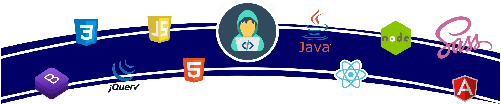

<h2 align="center">
    Hello, world. 👋
</h2>

    <b>I'm Thyago, passionate about different areas of this wonderful world of technology.</b>

    Welcome to my github, here you will find my projects and collaborations for the open source world.

 

    

    <i>You can find me or contact me through these networks:</i>
      
    
    
    
    

    
More about me

    
Passionate about technology, always ready to learn and help!
    

    <ul>
        <li>🎓 Information system | Estácio</li>
        <li>🎯 Contributing and creating open source projects</li>
        <li>📚 Studying Javascript | Java | Dev Web | .NET | JavaScript | Angular | SQL</li>
        <li>💬 You can ask me questions, I like to help!</li>
    </ul>

    
My Statistics on Github

    

        <b>Statistics on Github</b>  
        
    

    

        <b>The technologies used in the projects</b>  
        
    

